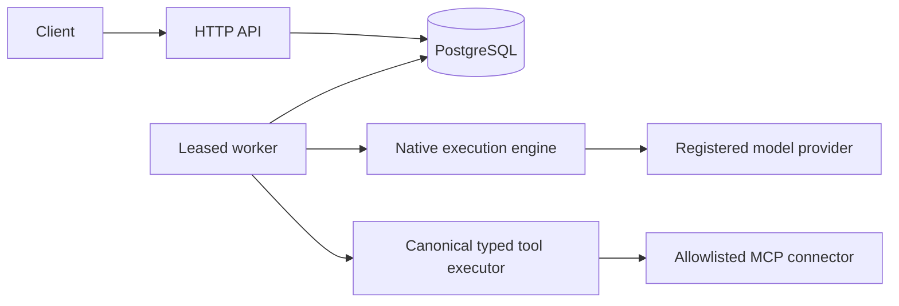
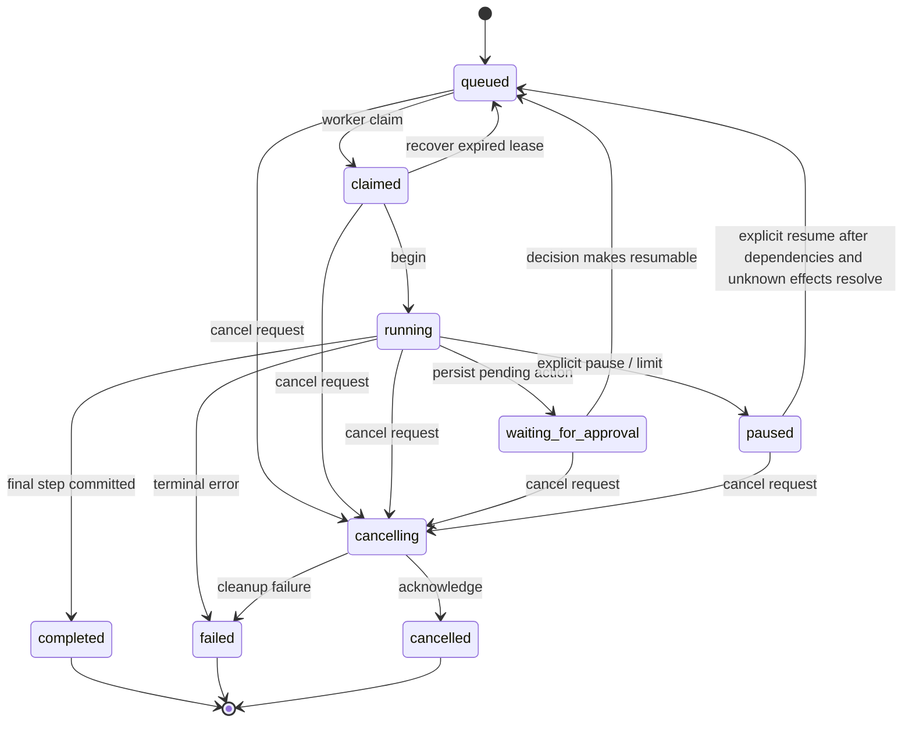
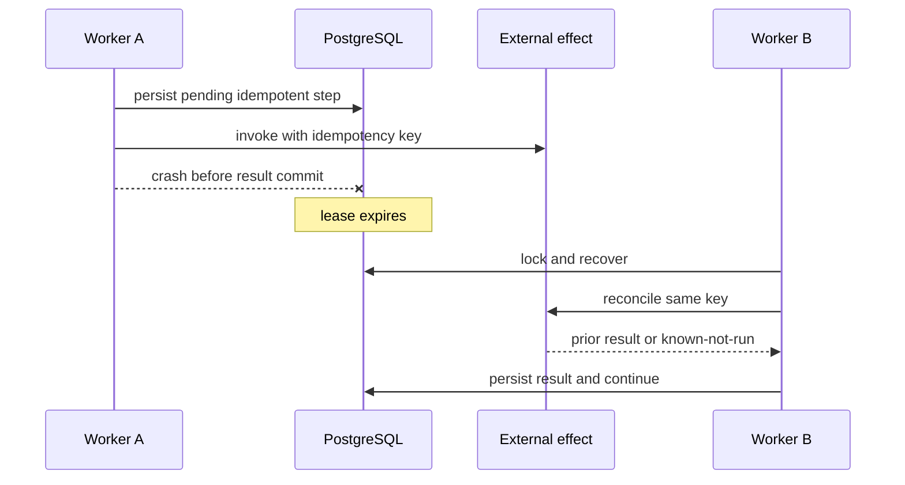
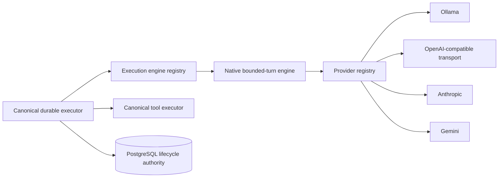

# Architecture overview

Optional [ML V1](ml.md) is an isolated `src/ml` module. It extends canonical runs with workload-filtered leased training, frozen dataset/pipeline versions and attempt evidence. The backend owns computation only; PostgreSQL owns progress, artifacts, registry versions and prediction records. ML is disabled by default and adds no scheduler, UI or identity system.

## Boundary and modules

The platform is one TypeScript modular monolith with an HTTP process and one or more worker processes sharing PostgreSQL. PostgreSQL is the system of record. The API records commands; leased workers advance the same canonical run. Providers and tools are ports invoked only by the canonical executor in later stages.



- `domain`: state, schemas, transition policy; no I/O.
- `db`: transactions, migrations, tenant-scoped repositories, locking.
- `api`: identity boundary and HTTP mapping; never runs agent work inline.
- `worker`: claiming, heartbeat, recovery, cancellation, and the native Stage 3 executor.
- Model providers, the native engine, tools, context, plans, memory, and retrieval plug into the worker; none owns another lifecycle.
- Multi-agent supervisors create persisted child runs only through the canonical delegation tool; every child follows this same lifecycle.

## Canonical lifecycle



Only `src/domain/run-state.ts` is authoritative. Terminal states never transition. Completion is forbidden after cancellation is requested.

## Persistence

Agents hold versioned tenant-owned model, composition, and context policy. Runs hold lifecycle, budgets, optimistic version, and denormalized active lease. Steps are append-oriented idempotent decisions/effects. Model attempts record each provider call without raw prompts/responses. Approval rows freeze validated action identity and record role-separated decisions and single consumption. Versioned checkpoints freeze checksum-protected working state; context builds record their checkpoint, plan, summary, budget, selection, omissions, and provenance. Worker leases record ownership evidence. Tool executions are the side-effect ledger. Usage and audit records are append-oriented by repository convention.

Aggregate mutations use a transaction and row lock or version predicate, with an audit event in the same commit.

## Durable child-run orchestration

`delegate_run` is a reconcilable keyed tool, not a second scheduler. It creates a tenant-owned child `runs` row plus immutable `run_delegations` evidence, role/context metadata, and bounded child budgets. Parent budget capacity is reserved when the child is created. Child execution uses ordinary queue claims and leases. A parent records an `orchestration_waits` row and releases its lease while direct children remain active; the worker-side orchestration scheduler requeues it only after all direct children are terminal.

Required failed, cancelled, or empty child results prevent parent completion in both the application service and a database trigger. Parent cancellation recursively marks non-terminal descendants cancelling. Descendant approvals, tool authorization, side-effect idempotency, provider attempts, and completion remain entirely canonical. Shared context is an explicit bounded snapshot; private delegation does not inherit parent steps. Agent ancestry and fixed depth limits prevent delegation loops, and row locks plus per-parent parallel/child limits bound fan-out. See `orchestration.md`.

## Context, plans, and checkpoints

The native context builder deterministically preserves system instructions, the unresolved goal, active plan, and unresolved approvals. It then incorporates a durable summary and relevance-ranked recent terminal steps within the smaller of the agent input budget and known model context window after output reservation. Selection uses goal overlap, error significance, and recency. If required constraints alone exceed the budget, execution fails closed rather than silently truncating them. The token estimator is an explicit JSON-character approximation, not a provider tokenizer.

Older steps remain in the canonical trace. A deterministic digest is persisted with source sequences and an audit event; repeated builds reuse the same summary boundary. Each build restores and checksum-validates the last working checkpoint, replays current database state, writes a new checkpoint, and persists selection provenance. Reconstructing with a new process produces equivalent messages for unchanged state.

The optional native planner accepts only an acyclic validated task graph. Tasks carry objective, dependencies, runtime-derived status, native executor assignment, attempt count, result/error, and prior-step evidence. Revisions are immutable history; completed tasks cannot be removed or redefined, failures block dependants, and cancellation forbids revision. Providers only propose revisions. An active plan with incomplete required tasks prevents canonical run completion.

## Authentication and tenant boundary

The API validates HS256 JWT signature, algorithm, issuer, audience, expiry, subject, token ID, tenant, identity type, revocation, and active tenant membership. Effective roles are the intersection of signed claims and persisted membership roles. User and service identities share this validation contract. Header-based identity exists only behind explicit non-production configuration.

After authentication, every API operation runs in one database transaction under the non-login `durable_agent_api` role with a transaction-local tenant setting. PostgreSQL row-level policies restrict all current tenant-owned runtime tables even if an API query accidentally omits its tenant predicate. Workers retain the migration-owner path because cross-tenant queue claiming is their explicit responsibility; that credential is therefore a high-trust boundary rather than an RLS-protected client credential.

## Durable memory

Memory is a tenant-owned record separate from transient context and checkpoints. User memories are visible only to their owner; agent memories require an explicit agent and tenant memories are shared within the tenant. Each record carries structured content, provenance, a creation reason, source run when applicable, writer/source, relevance metadata, retention timestamp, correction ancestry, and soft-deletion evidence. Corrections append a new version and retire the prior record rather than overwriting provenance.

Authenticated users may deliberately create their own user memory. Shared agent/tenant memory management requires `memory_manager`. A model can propose only the `memory_store` tool, which requires the agent's explicit memory policy, the worker's `memory_write` role, and human approval. Exact approved arguments resume through the canonical `ToolExecutor`; model messages are never automatically retained.

The native context builder selects only active, unexpired memories visible to the run creator and current agent. It uses deterministic goal-term overlap plus declared importance, obeys separate item/token budgets, marks the material as untrusted data, and persists selected memory IDs on the context build. Memory selection remains lexical and is distinct from document retrieval.

## Retrieval and RAG

Document ingestion accepts bounded text, Markdown, or JSON content, extracts deterministic text, chunks it, obtains embeddings from an explicitly configured real provider, and persists versioned documents plus pgvector-backed chunks. A document becomes current only after every embedding and chunk row commits atomically. A failed embedding leaves durable failed ingestion evidence and never substitutes synthetic vectors.

Private documents are visible only to their owner; tenant-visible documents require `document_manager` authority to create or manage. Search applies tenant, visibility, current-version, deletion, embedding-model, and metadata predicates before returning bounded ranked chunks with document/version/chunk/content-hash citations. Soft deletion propagates across every version and chunk of the logical document. The API path is additionally protected by RLS.

Retrieval is a bounded native component and the `knowledge_search` typed tool; both use the same service. Retrieved text is labeled untrusted evidence, appended only after required run state and recent persisted steps, constrained by separate chunk/token limits, and recorded by chunk ID in `context_builds`. It cannot supply control instructions, mutate lifecycle state, or execute tools. No network document fetch, OCR, broad file parser, fake embedding, or autonomous ingestion exists.

## Governed skills and connectors

Skills are versioned tenant records with source classification, creation reason, optional source URI, content hash, author, and revocation evidence. Only `skill_manager` may create, revise, or revoke them. An agent explicitly selects immutable current versions; a skill may guide proposals but cannot add tools beyond the agent allowlist. Selected skill IDs and content hashes are persisted with context evidence. Skills are operator-authorized control text, unlike memories, documents, and connector descriptions, which remain untrusted data.

An MCP connector is a tenant-owned identity bound to an exact endpoint, environment credential reference, explicit tool allowlist, execution roles, and a durable PostgreSQL rate limit. Discovery uses the current stateless HTTP protocol implemented by this stage, validates bounded no-reference JSON Schema 2020-12 definitions, and persists the catalog and schema hashes. Server instructions, descriptions, and tool annotations are untrusted hints and never alter risk or retry policy.

The model sees only a bounded untrusted catalog and can propose the single canonical `mcp_call` tool. `mcp_call` is always high risk, keyed, non-retryable, and approval-required. Approval freezes its validated connector/tool/arguments identity. A reclaimed worker reauthorizes the connector and exact frozen action before `ToolExecutor` invokes the transport. Revocation before resume prevents the call. Post-dispatch uncertainty becomes the existing `unknown`/manual-reconciliation state and is never replayed automatically.

## Ownership, lease, and recovery

Claim uses `FOR UPDATE SKIP LOCKED`, transitions `queued -> claimed`, assigns owner/expiry, increments version, and records the lease in one transaction. Only the matching unexpired owner can heartbeat or start. Recovery locks expired active runs. Expired active runs return to `queued`, unless cancellation was requested, in which case they become `cancelled`. Wait and terminal states release leases.

Lease expiry does not prove an external effect did not happen. Tool execution therefore persists an idempotency key and requires provider-level idempotency or reconciliation before retry. An unknown outcome fails closed.

## Tool and approval contract

Tool input is validated and authorized before a pending execution is persisted. `(tenant_id, idempotency_key)` is unique. Completed duplicate keys return their recorded result. Pending keys are reconciled, never blindly invoked. Inputs/outputs are schema checked; timeout alone never implies safe retry.

When policy requires approval, the runtime atomically persists the pending tool step, execution ledger row, immutable validated arguments and SHA-256 canonical argument hash, requester, approver role, risk evidence, audit events, and `waiting_for_approval` transition while releasing the lease. The API records an idempotent authorized decision but never executes the tool inline. Approval requeues the run; the next leased worker verifies and consumes the exact frozen action through `ToolExecutor` before any new model call. Rejection produces a deterministic failed tool result and requeues for model replanning. Cancellation prevents later consumption.

## Agent loop sequence

The direct tool, approval, exact-resumption, and final-answer branches are implemented.

```mermaid
sequenceDiagram
  participant A as API
  participant D as PostgreSQL
  participant W as Worker
  participant M as Model adapter
  participant T as Tool registry
  A->>D: create queued run
  W->>D: claim + lease
  W->>D: persist model-call intent
  W->>M: structured request
  M-->>W: validated action
  W->>D: persist model result
  alt approval required
    W->>D: persist pending tool and approval; release lease
    A->>D: record authorized decision only
    W->>D: reclaim, verify hash, consume frozen action
    W->>T: execute exact persisted action
  else authorized tool
    W->>D: persist pending idempotency key
    W->>T: execute
    T-->>W: validated result
    W->>D: persist tool result
  else final answer
    W->>D: persist answer then complete
  end
```

## Recovery and reconciliation sequence

Unknown effects are never replayed automatically. A reconcilable tool may provide a status-lookup contract; leased reconcilers persist succeeded, failed, still-pending, or manual outcomes. Every paused-to-queued production path checks the persisted tool ledger and leaves the run paused while any unknown effect lacks an explicit resolved outcome. Tools without a lookup contract remain manual, and `manual` is an unresolved state rather than permission to resume. Lease recovery classifies persisted pending versus running tool/model boundaries before deciding whether a run can continue, pause, or fail.



Database failure before commit has no durable effect; after commit recovery reads the persisted state. Cancellation is checked before claims, external calls, and finalization.

## Database deployment portability

The application knows PostgreSQL only through `DATABASE_URL`. Docker Compose is one provisioning option, not an application dependency. Supported topologies are:

1. host API and workers with Compose PostgreSQL;
2. host API and workers with host-installed, remote, or managed PostgreSQL;
3. containerized API/workers with containerized or external PostgreSQL.

The same SQL migrations and application paths apply in every topology. PostgreSQL 16 is the verified version; PostgreSQL 15+ is the compatibility target. TLS, credentials, DNS, pooling, backup, and high availability are deployment responsibilities. `pgcrypto` is required for UUID generation and Stage 9 requires the `vector` extension. Compose uses the pgvector PostgreSQL 16 image; host and managed deployments must expose a compatible extension.

## Providers, engines, and components

These are separate extension points:

- A **model provider** maps canonical model requests/responses to one inference API. Provider IDs are open strings. Initialized providers and provider factories are registered without a switch in the executor.
- An **execution engine** performs one bounded turn using a provider. Stage 3 enables only `native`; external engines are disabled explicitly.
- A **component adapter** may later replace bounded planners, retrievers, context builders, memory strategies, summarizers, output parsers, or model-turn engines.

The custom durable runtime is always the control plane. Run lifecycle, leases, transition enforcement, approval decisions and consumption, tool authorization, side-effect idempotency, cancellation, budgets, audit evidence, tenant ownership, and terminal completion are canonical and non-replaceable. No provider or engine may implement approval independently. External engines may only propose tool actions; sensitive actions always enter the canonical tool executor. Provider fallback occurs only from an explicit persisted candidate list and only after retryable failures with capability compatibility. Framework fallback remains prohibited. Changing an engine requires a new run or an explicit persisted configuration revision.



Adding a provider consists of an isolated adapter, request/response mapping, raw-response validation, normalized error mapping, capability metadata, one factory registration, and contract tests. It does not change lifecycle transitions, leasing, authorization, approvals, cancellation, repositories, or completion logic.

## Multi-agent deployment and Kubernetes

Kubernetes is not required for the implemented child-run orchestration. Multiple ordinary worker processes or containers claim supervisor and child runs through PostgreSQL leasing; bounded concurrency is persisted policy, not a deployment per logical agent. Kubernetes may later scale worker pools, schedule GPUs, isolate resources, or support rolling operations. It must not become lifecycle authority or create a permanent deployment per logical agent. PostgreSQL remains authoritative even if bounded Kubernetes Jobs are introduced.

## Evaluation boundary

Evaluation is an observer and workload producer, not an execution engine. A suite execution freezes an agent version/configuration hash and creates ordinary queued runs. Leased workers execute them through the same model, tool, approval, recovery, budget, and cancellation paths as every other run. After a run becomes terminal, a bounded scorer claims its case link with `SKIP LOCKED`, derives measurements from persisted trace evidence, and atomically updates evaluation history. Scoring completion and release-gate success are separate facts. No scorer can transition or complete the evaluated run.

## Observability boundary

Canonical PostgreSQL ledgers are the trace source; logging and metrics are derived views, never a second event or lifecycle system. API requests receive generated correlation IDs. Workers log bounded run claim/release metadata and persist minimal process heartbeats. Operator-only endpoints derive tenant-scoped queue, lease, usage, cost, and failure metrics under the existing API RLS transaction and expose deployment-wide worker heartbeat health. Provider health invokes configured adapter probes without changing run state. A shared redactor removes sensitive keys and bearer values before structured JSON emission.

## Deployment hardening boundary

One modular-monolith image exposes separate API, worker, and migration commands. A one-shot migration process gates API/worker startup. Readiness verifies PostgreSQL, the repository migration set, and drain state. API shutdown stops admission and waits to a deadline; workers stop between bounded scheduler phases. Forced termination is handled by canonical leases and unknown-effect classification. Replica pool and container resource ceilings change capacity, never lifecycle authority.

## Product boundary

The API serves a small same-origin HTML/CSS/JavaScript shell. It has no direct database or provider access and is not a security boundary. Every data operation reuses authenticated, role-checked, tenant-scoped APIs and canonical repositories. The public shell contains no tenant data; JWT issuance and first-administrator bootstrap remain external. Membership management has explicit tenant predicates and RLS. Disabled connectors or retrieval stay disabled in the UI.
